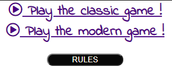
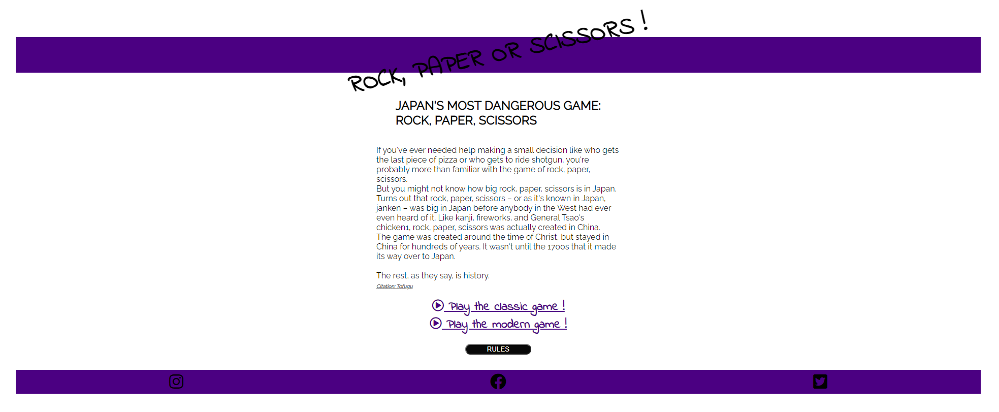
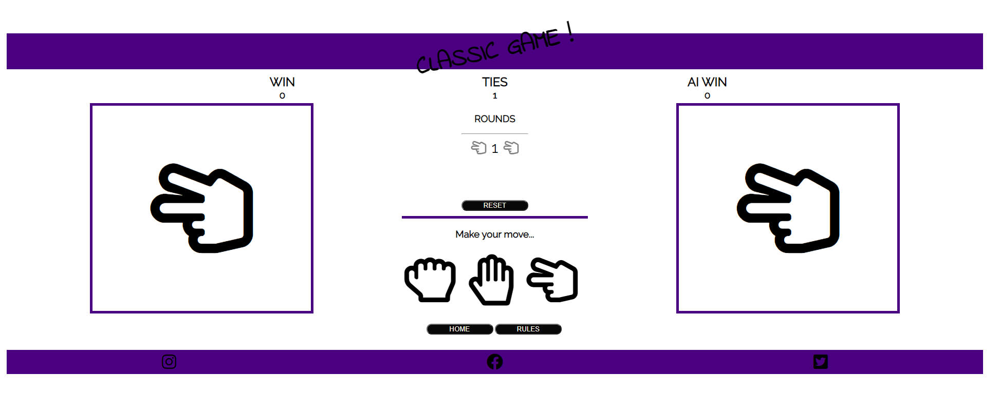
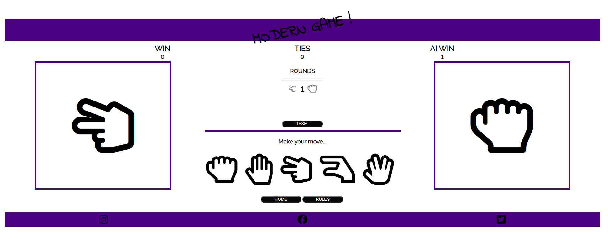
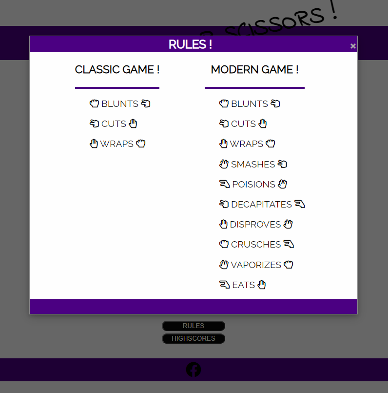
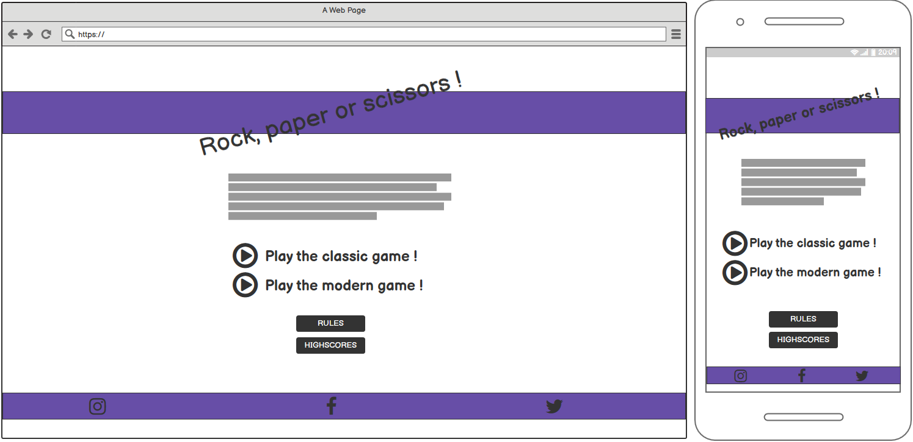
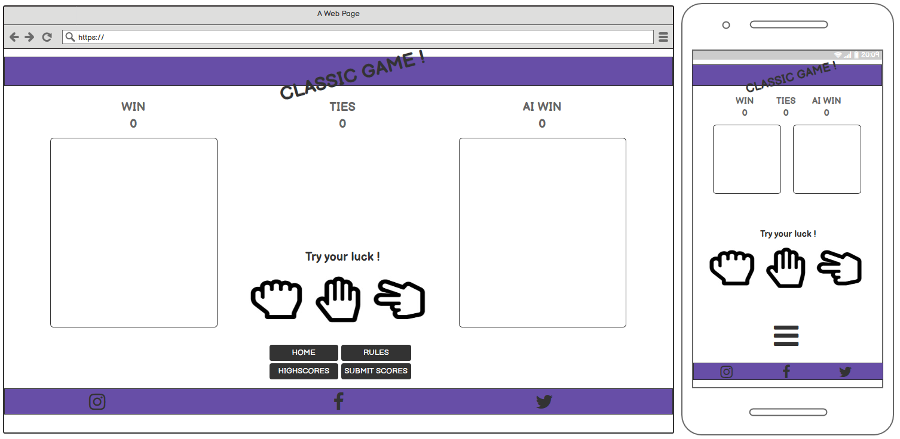
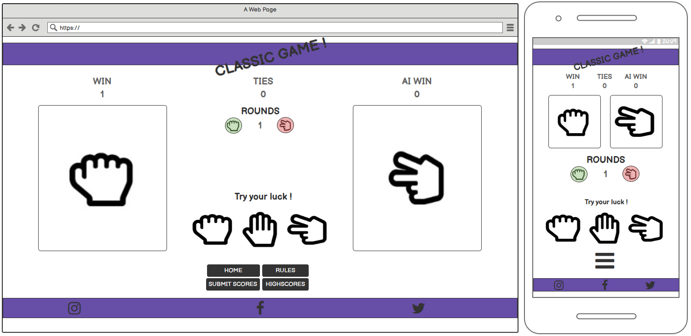
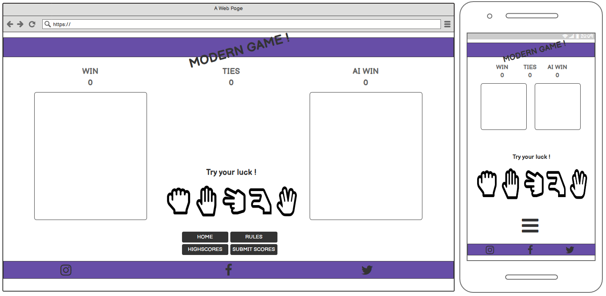
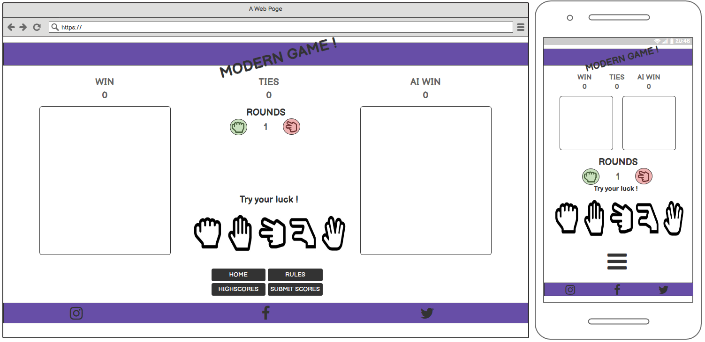

# RPS-GAME

The primary goal of this site is to give visitors a fun time and to have a place to relax.

## The ideal user of this site:
* Has a passion for games.
* Is curiouse of playing games online against a computer.

## User Stories:
* As a user i want to know the main purpose of the site directly on arrival.
* As a user i want to easily find my way on the site.
* As a user i want to have fun when visiting the site.
* As a user i want to compete against a computer.
* As a owner i want the users to feel happy and have a good time when visiting my site.

# Features
* Navigation 
    * Featured on all pages, to allow for easy finding their way around the site.

* navigation on play pages

* Landing page
    * The landing page includes a welcome text with som background of the game.

* Classic game page

* Modern game page

* Rules popup modal

* Footer and social links.
    * The footer section includes links to the relevant social media sites for RPS-GAME. The links will open to a new tab to allow easy navigation for the user.

# Feauters left to implement.
*
*
*
*

## Validator testing.
* HTML
    * 
* CSS
    *
* JavaScript
    *
# Bugs.
    *
    *
    *
    *

# Deployment steps.
  * The site was deployed to GitHub pages. The steps to deploy are as follows:
  * In the GitHub repository, navigate to the Settings tab
  * From the source section drop-down menu, select the Master Branch
  * Once the master branch has been selected, the page will be automatically refreshed with a detailed ribbon 
    display to indicate the successful deployment.

The live link can be found here - https://gorsig.github.io/R-P-S-game/index.html

## Media
*
*

## Technologies used.
* 
*

## Wireframes.

## Other help.
*
*
*
*

